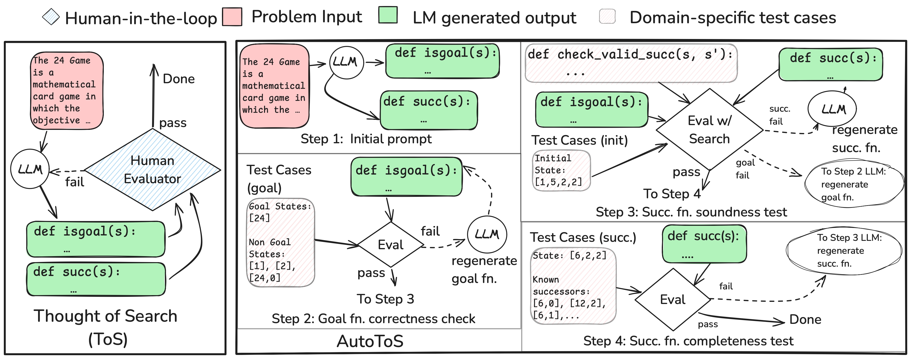

  

# 🔍 Thought of Search: The Best of Both Worlds 
<!-- Classical Planning and Language Models with Soundness and Efficiency -->
## Bridging the rigor of the classical search with the modeling knowledge abilities of language models 

### **Daniel Cao, [Michael Katz](https://ctpelok77.github.io), [Harsha Kokel](https://harshakokel.com), Kavitha Srinivas, Shirin Sohrabi**

In the fast-evolving landscape of AI planning, large language models (LLMs) have taken center stage. But while LLMs shine in flexibility, their use in decision-making tasks often comes at the cost of **soundness** and **completeness**. The **Thought of Search (ToS)** research initiative challenges this tradeoff.

This line of work, spearheaded by the [NeurIPS 2024](https://proceedings.neurips.cc/paper_files/paper/2024/file/fa080fe0f218871faec1d8ba20e491d5-Paper-Conference.pdf) paper *"Thought of Search: Planning with Language Models Through The Lens of Efficiency"*  aims to harness the strengths of LLMs **without abandoning the guarantees** that make classical planning reliable.

---

## 🧩 What is “Thought of Search”?

“Thought of Search” is a novel paradigm that reframes how LLMs are used in planning. Instead of having LLMs directly generate plans—which may be invalid or incomplete—ToS uses LLMs to generate **search components**, specifically:

* A **successor function**, which defines how states evolve through actions.
* A **goal test**, which checks whether a state satisfies the desired condition.

These two functions are the two core components of any **classical search algorithm** (like BFS or DFS), and we can therefore plug them into such algorithms to obtain a **solver** for a family of problems. If the functions are implemented **correctly**, the resulting solver is **sound** and **complete**. This allows us to obtain correct **symbolic solvers** while keeping the LLM in a supportive, code-generation role.

  

---

## 📄 Paper 1: *Thought of Search: Planning with Language Models Through The Lens of Efficiency*

In this paper we outline the ToS methodology and demonstrate that LLMs **in partnership with a human expert** can reliably generate executable and correct implementations of the successor and goal functions. The generated code is then evaluated using standard search algorithms, ensuring the correctness of plans **without excessive LLM calls** or reliance on opaque heuristics.

Key results:

* Reliably achieved **100% task success** across all tested planning domains.
* Required **only a small constant number of LLM calls** per domain, irrespective of the number of problem instances in the domains. This is compared to prompt-based baselines like ReAct or ToT that require **hundreds of LLM calls** per problem instance and are unreliable.
* Introduced a framework that separates reasoning (search) from language generation (components).

📖 Read the paper: [NeurIPS 2024](https://proceedings.neurips.cc/paper_files/paper/2024/file/fa080fe0f218871faec1d8ba20e491d5-Paper-Conference.pdf)

---

## 🤖 Paper 2: *Automating Thought of Search: A Journey Towards Soundness and Completeness*

The sequel by Cao et al. (2024) takes the vision further. Instead of relying on human-written examples or hand-crafted prompts, they present **AutoToS**, a system that automates the entire process. AutoToS leverages LLMs to:

* Generate candidate functions.
* Evaluate them with **unit tests** derived from problem instances.
* Iteratively refine until all tests pass, an indication of soundness and completeness.

AutoToS effectively **bootstraps classical search from scratch** using only language—and does so **without sacrificing formal guarantees**.

Key innovations:

* Use of **iterative self-refinement** driven by feedback.
* Taking the human experts out of the loop of interaction with the language model.
* Retains 100% accuracy on tested domains.

 

🤖 Check out this [example interaction with an LLM](blog/chat.html)  &nbsp; &nbsp; &nbsp;     📖 Read the paper: [arXiv:2408.11326](https://arxiv.org/abs/2408.11326)   &nbsp; &nbsp; &nbsp;    💻 Explore the code: [GitHub – AutoToS](https://github.com/ibm/AutoToS)

---

## 🧠 Why Does This Matter?

Most prior approaches to LLM-based planning treat the model as the planner. While this allows for maximal flexibility, these systems  **lack any guarantees**—and that's a dealbreaker for critical applications like robotics, logistics, or safety-sensitive systems. Many of these approaches are also extremely inefficient, calling the language model many times per instance.

**Thought of Search turns this approach inside out**: let the solver remain classical and verifiable, but let LLMs do the heavy lifting of generating the code of the solver components. It’s a **division of labor** that preserves both **generalization** and **rigor**, while being highly efficient at inference time.

---

## 🤖 What about large state spaces?

The BFS/DFS algorithms are often called blind search algorithms, since they blindly explore some portion of the state space and hence might not be as efficient for problems with large state spaces, and state spaces become extremely large very quickly. To exemplify, 24 game has about 4500 states, but if you have 5 numbers instead of 4 in your initial input, then it has around 27,000 states, and with 6 numbers over 24 million states. At about 32 numbers, the state space size exceeds the number of particles in the known Universe. Still, we want and can solve problems with such large state spaces. 

Heuristic search algorithms such as Greedy Best-First Search (GBFS), Monte-Carlo Tree Search (MCTS) or A*, are known to efficiently search through large state spaces, with the help of a guidance function, also called heuristic function. These functions help prioritizing exploring some states over others by assigning numeric values to states. Recent work by [Tuisov et. al.](https://arxiv.org/abs/2501.18784) and [Corrêa et. al.](https://arxiv.org/abs/2503.18809) started looking into generating heuristic functions with the help of language models, and we believe there is much more to come, exploiting the knowledge gained over the years by the planning community in how to efficiently solve search and planning problems.

## 🚀 What’s Next?

Thought of Search opens doors to several promising directions:

* Can we apply ToS to **probabilistic planning** or **multi-agent systems**?
* How do we handle **very large state spaces**, where even classical search becomes infeasible? Heuristic functions, search pruning techniques, etc.
* Could we extend this to dynamic environments or **real-time planning**?

These questions are already being explored by the authors and the broader planning/LLM community.

---

## Final Thoughts

The Thought of Search framework is an elegant and efficient bridge between symbolic AI and LLM-based reasoning. By reframing how LLMs contribute to planning—not as plan generators, but as code-writing collaborators—it strikes a balance between the **formal guarantees of classical AI** and the **expressive power of language models**.

If you're working on planning, LLMs, or hybrid systems, ToS is a line of research well worth watching—and building on.

